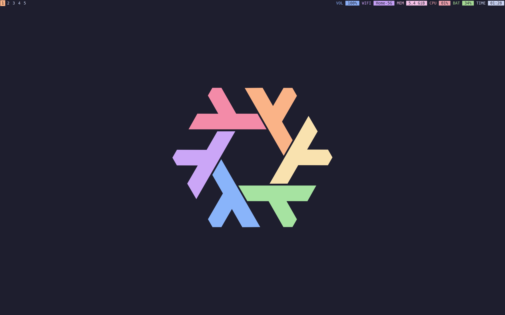
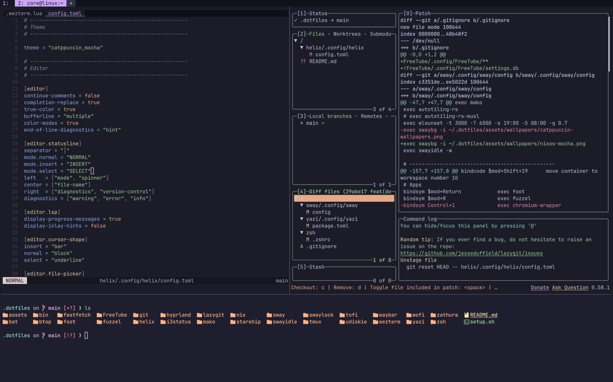
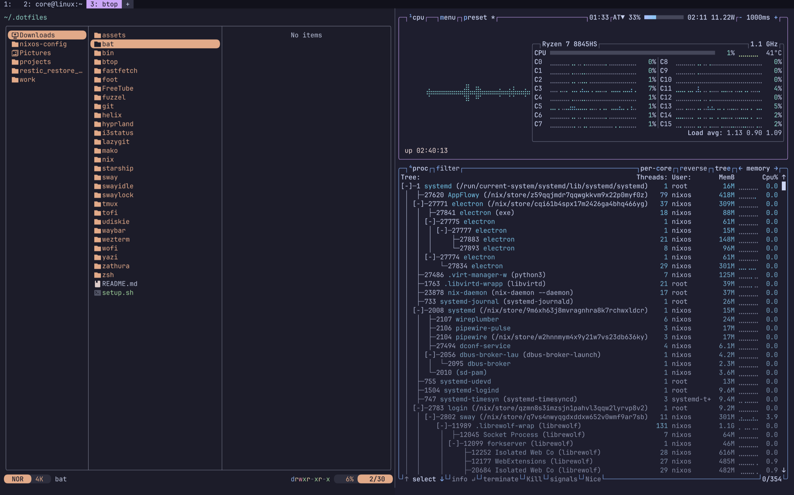

# HX dots

A fast, keyboard-driven Wayland environment built for deep focus. Minimal surface, maximal efficiency.
Powered by Sway and modern Rust/C tools.

## Showcase

 

<h2>
  
  Desktop
</h2>

###  Sway Ecosystem

| Description        | Tool                                           | Language |
| :----------------- | :--------------------------------------------- | :------: |
| Wayland compositor | [Sway](https://github.com/swaywm/sway)         |  ![][c]  |
| Idle daemon        | [swayidle](https://github.com/swaywm/swayidle) |  ![][c]  |
| Screen locker      | [swaylock](https://github.com/swaywm/swaylock) |  ![][c]  |
| Status bar         | [swaybar](https://github.com/swaywm/sway)      |  ![][c]  |
| Status generator   | [i3status](https://github.com/i3/i3status)     |  ![][c]  |

### Wayland Utilities

| Description          | Tool                                       | Language |
| :------------------- | :----------------------------------------- | :------: |
| Notification daemon  | [mako](https://github.com/emersion/mako)   |  ![][c]  |
| Application launcher | [fuzzel](https://codeberg.org/dnkl/fuzzel) |  ![][c]  |

 

<h2>
  
  Development Environment
  
</h2>

| Category | Role                     | Tool                                                | Language |
| :------- | :----------------------- | :-------------------------------------------------- | :------: |
| Shell    | Interactive shell        | [zsh](https://www.zsh.org/)                         |  ![][c]  |
| Shell    | Plugin manager           | [zinit](https://github.com/zdharma-continuum/zinit) | ![][sh]  |
| Shell    | Prompt engine            | [starship](https://github.com/starship/starship)    | ![][rs]  |
| Terminal | GPU-accelerated terminal | [WezTerm](https://github.com/wez/wezterm)           | ![][rs]  |
| Terminal | Wayland terminal         | [foot](https://codeberg.org/dnkl/foot)              |  ![][c]  |
| Terminal | Multiplexer              | [tmux](https://github.com/tmux/tmux)                |  ![][c]  |
| Editor   | Modal editor             | [Helix](https://github.com/helix-editor/helix)      | ![][rs]  |
| Git      | Terminal UI              | [lazygit](https://github.com/jesseduffield/lazygit) | ![][go]  |

 

## User Applications

| Category     | Role                   | Tool                                                    | Language |
| :----------- | :--------------------- | :------------------------------------------------------ | :------: |
| System       | Resource monitor       | [btop](https://github.com/aristocratos/btop)            | ![][cpp] |
| System       | System information     | [fastfetch](https://github.com/fastfetch-cli/fastfetch) |  ![][c]  |
| Media        | YouTube desktop client | [FreeTube](https://github.com/FreeTubeApp/FreeTube)     | ![][ts]  |
| Productivity | Document / PDF viewer  | [zathura](https://github.com/pwmt/zathura)              |  ![][c]  |

<!-- Language badges -->

[rs]: https://img.shields.io/badge/-rust-orange
[sh]: https://img.shields.io/badge/-shell-green
[go]: https://img.shields.io/badge/-go-68D7E2
[cpp]: https://img.shields.io/badge/-c%2B%2B-red
[c]: https://img.shields.io/badge/-c-lightgrey
[ts]: https://img.shields.io/badge/-TS-007BCD
